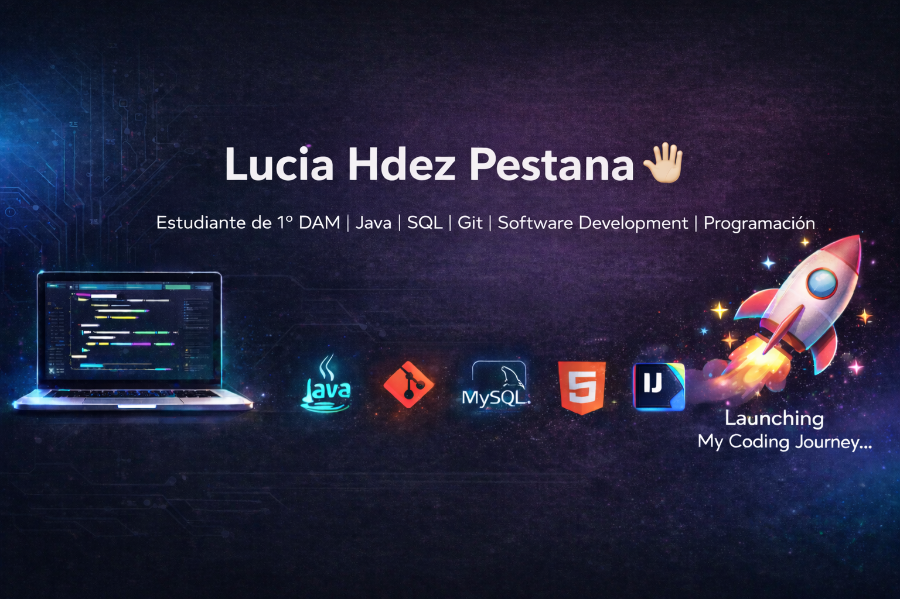

  

# ¡Hola! Soy Lucía Hernández Pestana 👋

## 🚀 Junior Developer | DAM | Java | Git | Software Development

Soy estudiante de **Desarrollo de Aplicaciones Multiplataforma (DAM)**, enfocado en aprender y aplicar las mejores prácticas de ingeniería de software y entornos de desarrollo. Actualmente, estoy trabajando en el proyecto **DEVNOVA**.

---

### 🛠️ Tecnologías y Herramientas
Mi stack de aprendizaje actual incluye:

* **Lenguajes:** 
* **Control de Versiones:**  
* **IDEs:**  

### 🎯 Objetivos en Entornos de Desarrollo
En este perfil y mis repositorios asociados, aplico prácticas profesionales de:
- ✅ **Configuración de entornos** eficientes.
- ✅ **Control de versiones** (Git Flow).
- ✅ **Depuración y Testing** (JUnit).
- ✅ **Documentación técnica** clara y concisa.

---

### 📫 Contacto
* **Email:** luciapestana@hotmail.es
* **Localización:** Los Llanos de Aridane, España 📍

