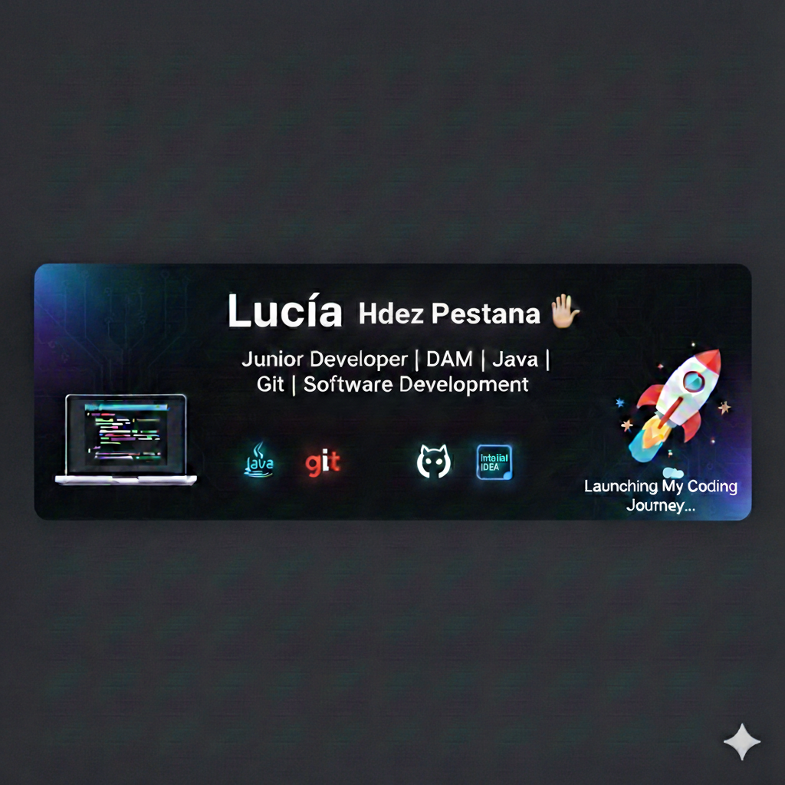

<h1 align="center">Hola, soy <a href="#">Lucia</a> 👋</h1>

 

## Sobre mí

- 🎓 Estudiante de **1º de DAM** (Desarrollo de Aplicaciones Multiplataforma).
- 💻 Apasionada por la tecnología y el aprendizaje continuo.
- 🚀 Actualmente enfocada en dominar la lógica de programación y Java.
- 📚 Explorando bases de datos, sistemas y diseño de interfaces.
- 🛠️ Construyendo mis primeros proyectos paso a paso.

---

### 🛠️ Tecnologías que estoy aprendiendo:

  
  
  

